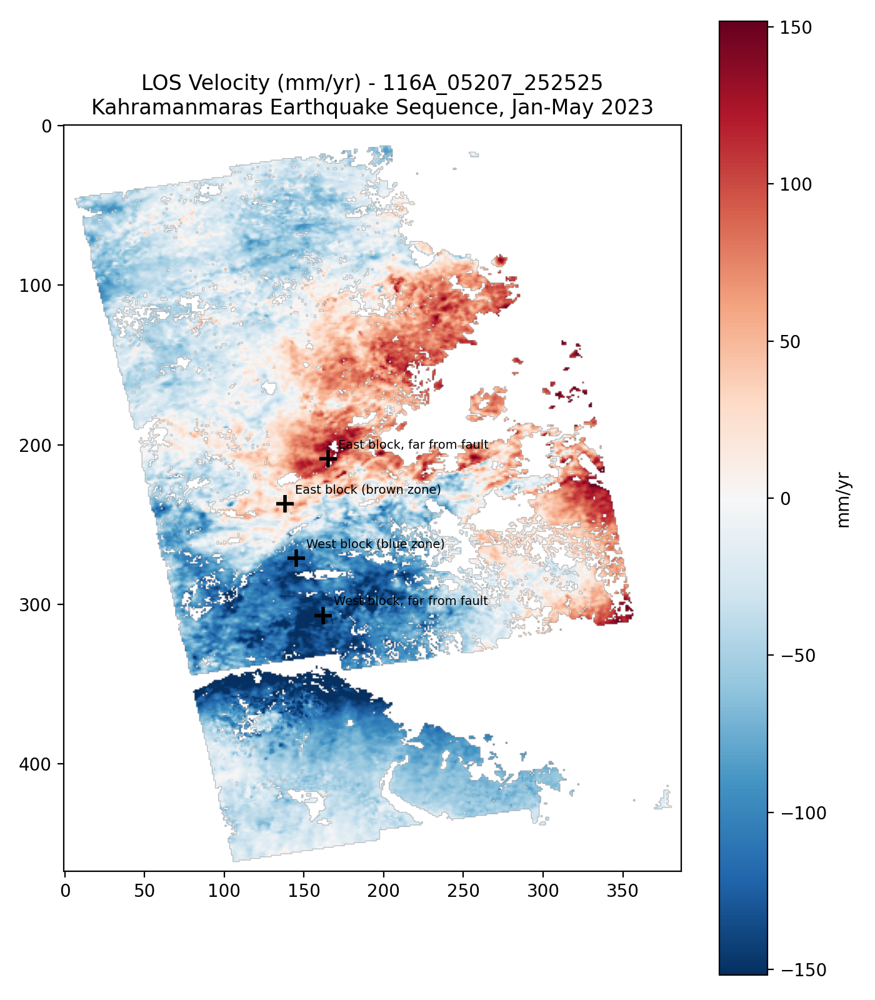
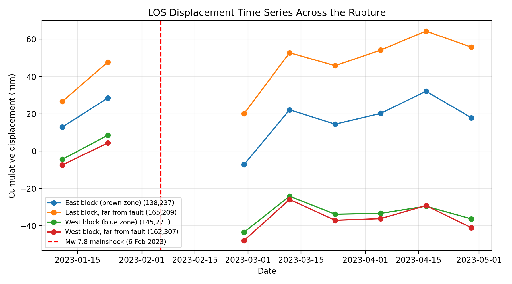
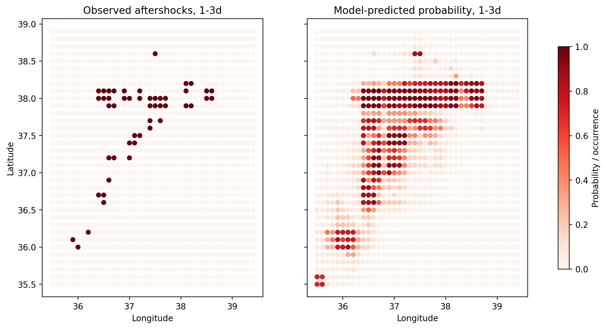
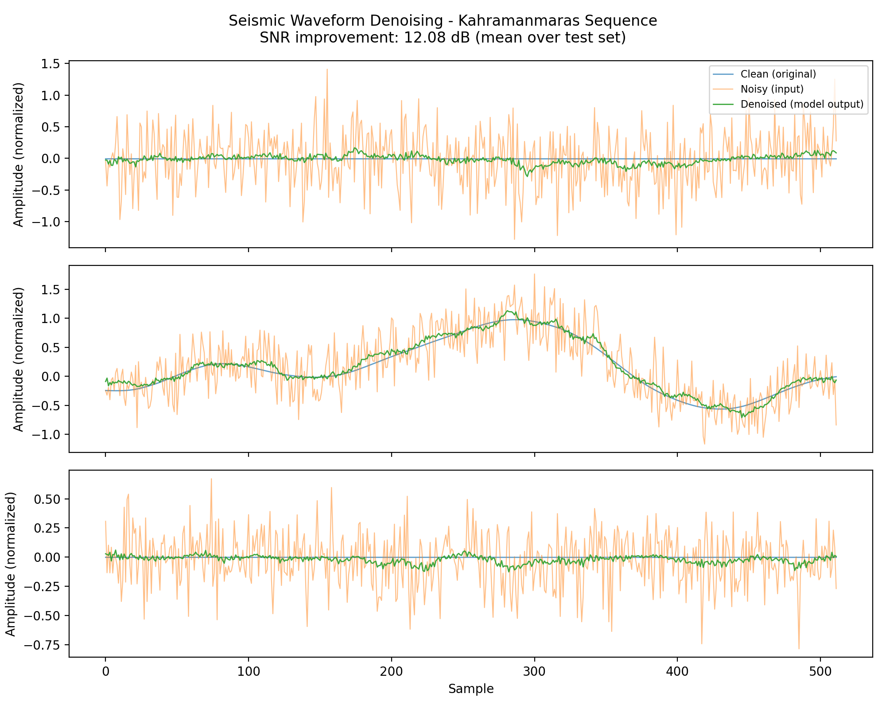

# Fault Deformation & Seismic Hazard Toolkit


A GeoAI toolkit that turns raw Sentinel-1 satellite radar and public
seismic data into three things: an automated fault deformation time
series (InSAR), a short term aftershock forecast (ML), and a denoised
seismic signal (autoencoder) - all built against one real,
well documented earthquake sequence: the **2023 Kahramanmaraş
(Turkey–Syria) earthquake sequence**.

An [integration notebook](notebooks/integration_notebook.ipynb) walks
through all three components together with the synthesis below.

## Why this project

Satellite geodesy and time series deformation analysis, geared toward
seismic hazard, active fault geodesy, and earthquake imaging research.

## Target event

**2023 Kahramanmaraş sequence.** Mw 7.8 mainshock near Pazarcık on 6 Feb
2023, followed ~9 hours later by an Mw 7.5 event near Elbistan. Rupture
spans ~345 km of the left lateral East Anatolian Fault and ~175 km of
the Çardak Fault - one of the best instrumented, most studied
strike slip ruptures in recent history, which makes it possible to
sanity check results against the published literature.

---

## 1. InSAR Fault Deformation

**Data:** [COMET-LiCS Sentinel-1 InSAR Portal](https://comet.nerc.ac.uk/comet-lics-portal/),
frame `116A_05207_252525` (ascending), covering the Adıyaman/Malatya
segment of the East Anatolian Fault. Date range: 2023-01-01 to
2023-05-01.

**Method:** Standard [LiCSBAS](https://github.com/comet-licsar/LiCSBAS)
pipeline — download → multilook (10x10) → coherence-based mask →
unwrapping QC → loop closure QC → SBAS/NSBAS inversion → velocity std →
time-series mask → temporal/spatial filtering.

**Result:** a clear positive/negative velocity dipole straddling the
fault trace the expected signature of left lateral strike slip
rupture, and a time series showing a step like offset bracketing the
earthquake in opposite directions on each side of the fault, with
block-to-block divergence of roughly 80–100 mm across the event window.





*("mm/yr" on the velocity map is a linear rate fitted across a short,
earthquake-dominated ~4-month window — it reflects the coseismic jump
annualized, not a steady long-term tectonic rate.)*

**Limitations:**
- The 4 Feb 2023 epoch was excluded — every interferogram pair using
  this date failed loop closure QC, consistent with a coregistration or
  unwrapping artifact specific to that acquisition, not the earthquake
  itself. The nearest clean bracketing pair used instead is
  `20230123_20230216`.
- Near fault decorrelation immediately after the mainshock is visible
  and expected physically consistent with coseismic surface
  disruption, not a processing error.
- GACOS atmospheric correction was not applied (requires a manual batch
  request via gacos.net) atmospheric noise has not been removed from
  the interferograms.
- Single ascending track only not cross validated against a
  descending track, and not a validated hazard product.

## 2. Aftershock Density Forecaster

Binary classification following [DeVries et al. (2018), Nature](https://www.nature.com/articles/s41586-018-0438-y):
does a given grid cell see ≥1 aftershock in a given time window since
the mainshock?

**Data:** USGS FDSNWS catalog, 30 days post mainshock, 456 events
(practical completeness ~M3.4 in this window).

**Method:** XGBoost classifier on distance from mainshock, grid
location, and time since mainshock. 0.1° (~11km) spatial grid × 5 time
windows (0-1d, 1-3d, 3-7d, 7-14d, 14-30d), built as a full grid
including negative (no-aftershock) examples.

**Result:** ROC-AUC 0.933, PR-AUC 0.457 (~16x the 0.028 random baseline
given class imbalance) the model correctly identifies the
fault aligned corridor as high risk.



**Limitation:** grid latitude/longitude combined outweigh
distance from mainshock in feature importance the model partly
learned this specific fault trace's coordinates rather than a purely
general distance decay relationship. Expected for a single event proof
of concept; the model wouldn't generalize to a different earthquake
without retraining.

## 3. Seismic Waveform Denoiser

**Data:** real waveforms from 3 stations (GE.EIL, IU.ANTO, IU.GNI) near
the epicenter, pulled via ObsPy/EarthScope.

**Method:** small 1D convolutional autoencoder (PyTorch). Genuinely
paired noisy/clean recordings don't exist for this use case, so
training pairs are synthetic: real waveforms cut into overlapping
windows, with randomized strength Gaussian noise added as the model
input and the real window as the reconstruction target standard
practice when paired data isn't available.

**Result:** 12.08 dB mean SNR improvement on held-out test windows
(-6.61 dB noisy input → +5.47 dB denoised output).



**Limitation:** only 5 raw traces from 3 stations were available via
EarthScope's public archive for this event (near field Turkish network
data isn't mirrored there) this demonstrates the technique works, not
a validated denoiser for arbitrary stations or events.

---

## Synthesis

Each component substitutes a cheap, wide area, publicly available
signal for something that traditionally requires dense in situ
instrumentation: InSAR in place of discrete GNSS point measurements,
the aftershock forecaster in place of expert manual hazard zoning
built from catalog data alone, and the denoiser extending the
effective range of existing seismic stations without new hardware.
None of these alone is a complete hazard monitoring system together,
they sketch a workflow where wide area, low cost signals do real
diagnostic work that would otherwise depend on sparse, expensive
point instrumentation.

## Reproducing this

```bash
# InSAR (requires LiCSBAS cloned separately: github.com/comet-licsar/LiCSBAS)
conda env create -f environment.yml
conda activate licsbas
pip install torch "numpy<2"   # see note below
python3 LiCSBAS/bin/LiCSBAS01_get_geotiff.py -f 116A_05207_252525 -s 20230101 -e 20230501
# ... full LiCSBAS step sequence, then:
python3 scripts/plot_deformation.py

# Aftershock forecaster
python3 scripts/fetch_aftershocks.py
python3 scripts/build_features.py
python3 scripts/train_aftershock_model.py

# Denoiser
python3 scripts/fetch_waveforms.py
python3 scripts/train_denoiser.py
```

**Note (macOS):** the denoiser requires `torch` and `numpy<2` installed
via pip alongside the conda environment (not in `environment.yml` by
default), and may need `export KMP_DUPLICATE_LIB_OK=TRUE` set to avoid
an OpenMP conflict between pip-installed PyTorch and the conda-forge
scientific stack.

## License

MIT — see [LICENSE](LICENSE).
